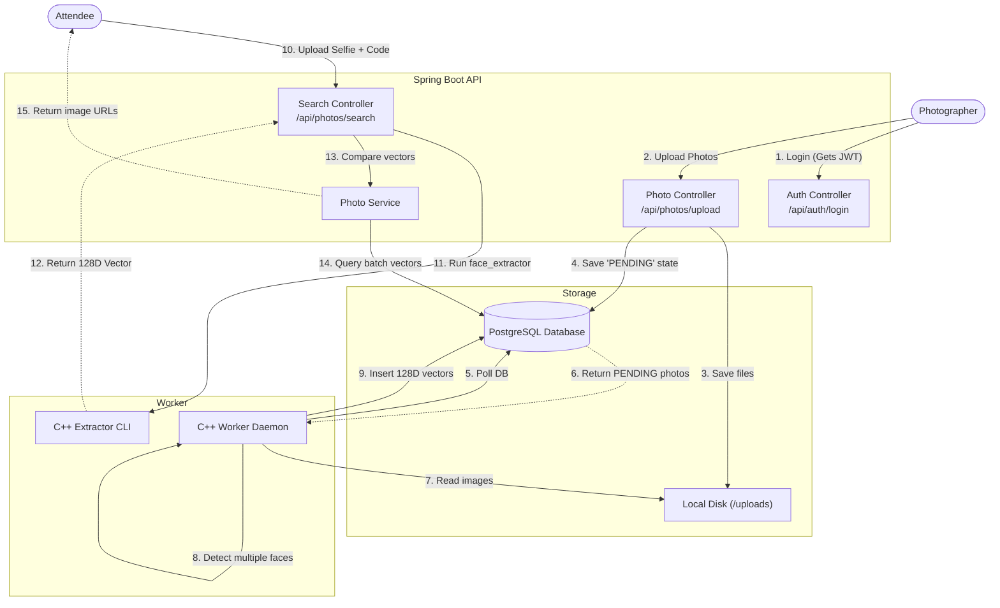
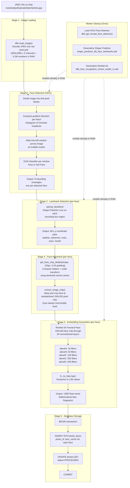

# PixelPull

A backend service for event photo distribution. Attendees upload a single selfie to instantly retrieve all group photos containing their face from a specific event batch.

## Features

- **JWT Authentication**: Secured endpoints allowing only registered photographers to create events and upload batches.
- **Batch Isolation**: Photos are grouped by an `accessCode`. Searches are scoped to a specific event, significantly reducing vector comparison overhead.
- **Asynchronous ML Worker**: A containerized C++ worker (using Dlib) polls the database to asynchronously extract 128D facial vectors from uploaded group photos.
- **In-Memory Vector Search**: Sub-second facial matching achieved via Java-based Euclidean distance calculations against PostgreSQL records.

---

## Architecture

The system uses a decoupled architecture to separate the heavy ML processing from the Spring Boot API.



---

## ML Pipeline Architecture

This diagram shows the internal flow of a single photo through the C++ Dlib ML worker — from raw JPEG on disk to 128-dimensional face vectors stored in PostgreSQL.



### Key Numbers at Each Stage

| Stage | Input | Output |
|-------|-------|--------|
| Image Load | JPEG file (~3MB compressed) | Raw pixel grid (6.2M numbers) |
| Face Detection | Full image grid | N bounding rectangles |
| Landmark Detection | One face rectangle | 68 (x,y) coordinate pairs |
| Face Alignment | 68 landmarks | 150×150 pixel chip |
| Embedding | 150×150 chip | 128 float numbers |
| Storage | 128 floats | 1 row in `photo_faces` table |

---

## Running Locally

**Dependencies:** Docker, Docker Compose, Java 17, Maven.

1. Start the PostgreSQL database and C++ worker container:
   ```bash
   docker compose up -d --build
   ```
   *(Note: The initial Docker build compiles Dlib natively and takes ~15-30 minutes).*

2. Start the Spring Boot API:
   ```bash
   cd PixelPull
   ./mvnw spring-boot:run
   ```

---

## API Reference

### 1. Photographer (Requires Auth)

**Register:**
`POST /api/auth/register`
```json
{
  "username": "admin",
  "password": "password123",
  "email": "admin@example.com"
}
```

**Login:**
`POST /api/auth/login`
Returns a JWT token.

**Upload Photos:**
`POST /api/photos/upload`
Headers: `Authorization: Bearer <token>`
Body: `multipart/form-data` with `files` (multiple images allowed).

**List Batches:**
`GET /api/photos/my-batches`
Headers: `Authorization: Bearer <token>`
Returns the `accessCode` mapping for uploaded events.

### 2. Attendee (Public)

**Search Photos:**
`POST /api/photos/search`
Body: `multipart/form-data`
- `selfie`: Image file of the attendee's face.
- `accessCode`: 6-character code provided by the photographer.

Returns a list of URLs pointing to the matched group photos.
