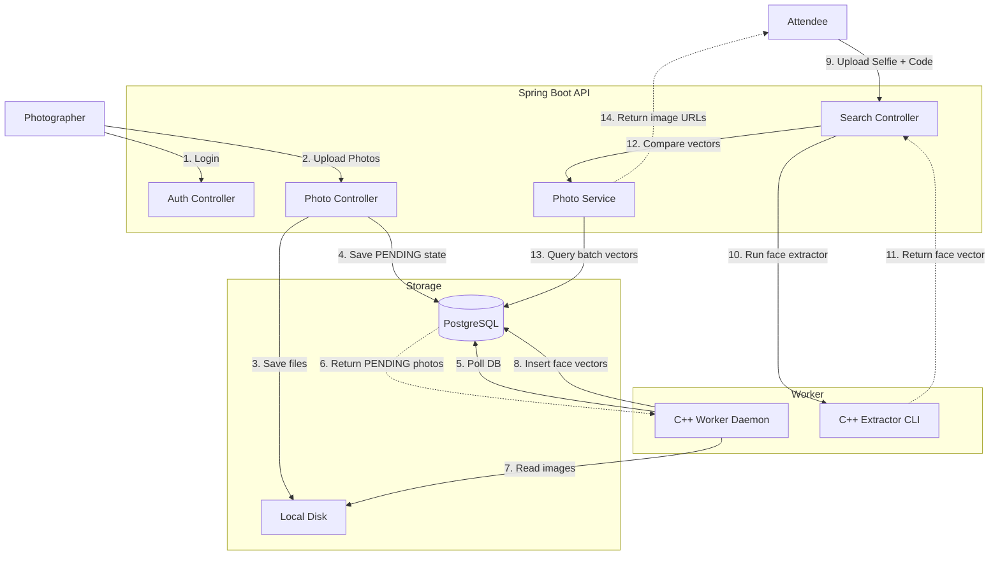
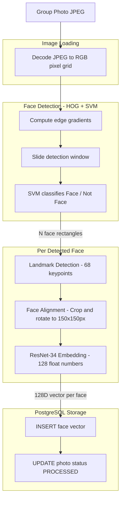

# PixelPull

A full-stack event photo distribution platform. Photographers upload an event album and get a 6-character access code. Attendees use that code + a selfie to instantly find every photo they appear in — powered by facial recognition.

## Features

- **React Frontend** — clean, dark UI with real-time upload feedback and face-search results
- **JWT Authentication** — only registered photographers can upload and manage batches
- **Batch Isolation** — searches are scoped to a specific event via `accessCode`
- **Async C++ Worker** — a containerized Dlib worker polls the DB to extract 128D face vectors from uploaded photos
- **Fast Face Search** — Java-based Euclidean distance comparison returns matched photos in under a second

---

## Architecture



---

## ML Pipeline Architecture

Flow of a single photo through the C++ Dlib worker — one stage per face found.



| Stage | What goes in | What comes out |
|-------|-------------|----------------|
| Image Load | JPEG file (~3MB) | Raw pixel grid (~6M numbers) |
| Face Detection | Full pixel grid | N bounding boxes |
| Landmark Detection | One bounding box | 68 (x,y) points |
| Face Alignment | 68 landmarks | 150×150 standardized chip |
| ResNet Embedding | 150×150 chip | 128 float numbers |
| Storage | 128 floats | 1 row in `photo_faces` per face |

---

## Running Locally

**Dependencies:** Docker Desktop, Java 17, Node.js 18+

### 1. Start the database and C++ worker
```bash
cd backend
docker compose up -d --build
```
> The first build compiles Dlib from source — takes ~15–30 minutes. Subsequent starts are instant.

### 2. Start the Spring Boot backend
```bash
cd backend
./mvnw spring-boot:run
```
> Runs on http://localhost:8081

### 3. Start the React frontend
```bash
cd frontend
npm install
npm run dev
```
> Runs on http://localhost:5173 — open this in your browser

---

## API Reference

### Photographer (Requires JWT)

**Register**
```
POST /api/auth/register
Content-Type: application/json

{ "username": "...", "password": "...", "email": "..." }
```

**Login**
```
POST /api/auth/login
Content-Type: application/json

{ "username": "...", "password": "..." }
```
Returns `{ "token": "<jwt>" }`.

**Upload Photos**
```
POST /api/photos/upload
Authorization: Bearer <token>
Content-Type: multipart/form-data

files: <image files>
```
Returns `{ "accessCode": "A1B2C3", "successfulUploads": 5 }`.

**List Batches**
```
GET /api/photos/my-batches
Authorization: Bearer <token>
```

---

### Attendee (Public)

**Search by Face**
```
POST /api/photos/search
Content-Type: multipart/form-data

selfie:     <selfie image>
accessCode: A1B2C3
```
Returns `{ "totalMatches": 2, "photos": [ { "imageUrl": "...", ... } ] }`.
